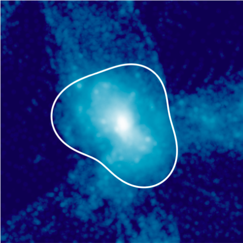

# Shellfish



Shellfish (**SHELL** **F**inding **I**n **S**pheroidal **H**alos) is a command line toolchain
for finding the splashback shells of individual halos within cosmological simulations.

After configuration, generating halo catalogs with shellfish can be as easy as the command
```bash
cat my_halo_catalog.txt | shellfish shell | shellfish stats > my_splashback_catalog.txt
```

Shellfish is currently in version 1.0.0. All future versions are garuanteed to be backwards compatible with any config files or shell scripts that work on version 1.0.0. The current maintainer is
[Phil Mansfield](http://astro.uchicago.edu/people/philip-mansfield.php) at the
University of Chicago. Shellfish is written in the programming langue [Go](https://golang.org/).

[](https://zenodo.org/badge/latestdoi/55451007)

### Getting help

If you run into problems that you cannot solve yourself, the best thing to do is to
[make a github account](github.com/join) (it's quick!) and submit an "Issue" about
your question or bug [here](https://github.com/phil-mansfield/shellfish/issues).
(Don't worry about the tabs on the right hand part of the submit form: I'll
take care of this when I see it). The second best option is to email me:
you should do this if you do not want your question or bug report to be public.

### Installation

There are two steps to installing Shellfish. The first is installing a Go compiler
(which is relatively painless compared to installing most other compilers), and the
second is compiling Shellfish and its dependencies (which is completely painless).

If you are working on a computer that you own, download the latest version of the Go
compiler from [here](https://golang.org/doc/install) and follow the instructions.
If you are working on a cluster, It's probably easiest to ask the cluster staff to install the
compiler for you. Regardless of how you install it, you will need to make a few changes
to your `.profile` file, so make sure to read the section titled *Test your installation*
and run the hello world program there (don't worry: you don't need to know the language to
use Shellfish).

Once you've done this, its time to download and install Shellfish's dependencies. You
will need the version control software [git](https://git-scm.com/) installed on your
machine. Run the shell script `download.sh` (no need for root access). To test whether
installation was successful, type `$ shellfish hello`.

After you've downloaded shellfish for the first time, you can update it to the latest
version at any time by running the shell script `update.sh`.

### How to Use Shellfish

Shellfish is a set of unix-like command line tools which produce human-readable catalogs.
You write a configuration file describing the layout of your particle snapshots and
halo catalog, specify the halos you want to measure the splashback shell for, and then
Shellfish will take care of the rest.

You can find a tutorial on using Shellfish
[here](https://github.com/phil-mansfield/shellfish/blob/master/doc/tutorial.md).
It typically takes about 10 minutes to read through.

### List of Supported File Formats

Currently supported particle catalog types:

* gotetra
* LGadget-2 (works on most other versions of Gadget, too)
* ARTIO (experimental)

Currently supported halo catalog types:

* All text column-based catalogs

Currently supported merger tree types:

* consistent-trees

If you would like to use a particle catalog type which is not supported here,
plase submit an Issue requesting support. Shellfish is written in a way that
makes it easy to interact with unsupported halo catalogs and meger trees (as
covered in [the tutorial](https://github.com/phil-mansfield/shellfish/blob/master/doc/tutorial.md)),
but feel free to submit an issue requesting support as well.

### Next Planned Release

The next planned release is version 1.0.0, which will contain a finalized API and
complete documentation.
